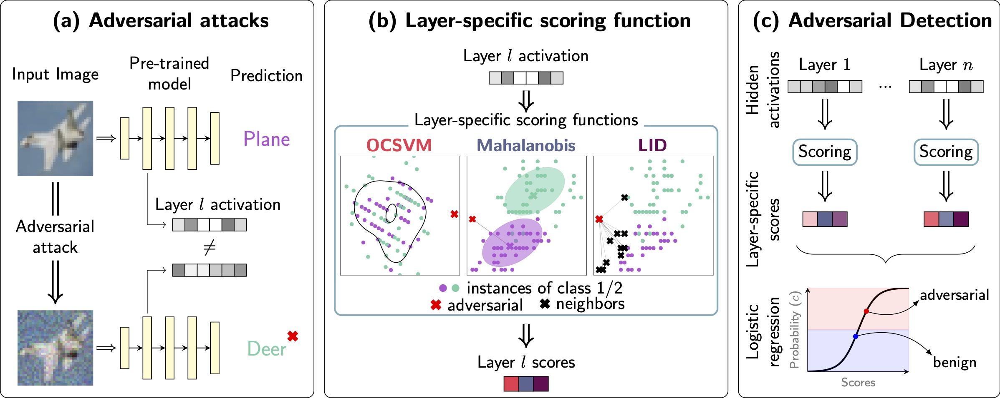

# Project of "Unity is strength: improving the detection of adversarial examples with ensemble approaches".

Project of "Unity is strength: improving the detection of adversarial examples with ensemble approaches".

# Code walkthrough

- `attacks` contains the attack used for the *Hard Transfer Attack* setting.
- `exad` contains the code implementing the *ExAD* adversarial detector.
- `maha_experiments` contains the *ENAD* detector pipeline starting from the *Mahalanobis* detector code ([link](https://github.com/pokaxpoka/deep_Mahalanobis_detector)).
- `pre_computed` contains the precomputed hyperparameters for the *OCSVM* detector defined for *ENAD* experimental results.
